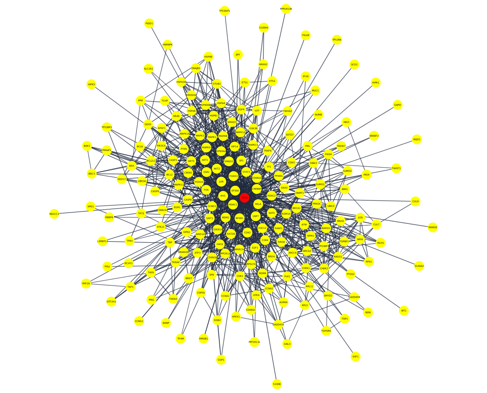

# Objective

The aim is to make a network analysis with 200 random nodes.

# Analysis

**Prerequisites**

First you need to set up your R environment. Install the required R packages, which are igraph and RCy3.

**igraph** is a collection of network analysis tools.

**RCy3** allows communication between R and Cytoscape.

```{r, eval=FALSE}
if(!"RCy3" %in% installed.packages()){
  install.packages("BiocManager")
  BiocManager::install("RCy3")
}

if(!"igraph" %in% installed.packages()){
  install.packages("BiocManager")
  BiocManager::install("igraph")
}
```


In addition to these packages (RCy3, igraph), you will need Cytoscape, which can be downloaded from http://www.cytoscape.org/download.php.

There is also a need for the STRING app to access the STRING database from within Cytoscape.

Install the STRING app from https://apps.cytoscape.org/apps/stringapp.

**Cytoscape** allows visualization and exploration of biological networks.

**stringApp** imports functional associations or physical interactions between protein-protein and protein-chemical pairs from several databases into Cytoscape.

**Load the libraries on R**

```{r, message=FALSE}
library(igraph)
library(RCy3)
```

**Make sure to launch Cytoscape, and now connect R to Cytoscape**

```{r}
cytoscapePing()
```

**Create data** 

There are different ways to create random data, such as by reading network data from files (edgelist, matrix), or by using functions, such as sample_gnp(), sample_gnm(), make_graph(), and graph_from_literal().

I used stringApp for the given task. I extracted 199 nodes that have a connection to the TP53 protein.

```{r}
cmd.string = 'string protein query query="TP53" cutoff=0.9 species="Homo sapiens" limit=199'
commandsRun(cmd.string)
```


**Transfer data**

The script above has created a network available on Cytoscape. Transfer it from Cytoscape to R for the rest of the analysis.

```{r}
network <- createIgraphFromNetwork()
```

**Decide the layout**

```{r}
# A list of available layouts
getLayoutNames()

# Select the “force-directed” layout. To see properties for the given layout, use:
getLayoutPropertyNames("force-directed") 
layoutNetwork('force-directed defaultSpringLength=70 defaultSpringCoefficient=0.000003')
```

**Verify the attributes of network**

```{r}
# The number of vertices and edges
igraph::vcount(network)
igraph::ecount(network)
```

```{r, eval=FALSE}
# The names of vertices and edges
V(network)
E(network)
```

**Diameter**

The shortest distance between the two most distant nodes in the network.

```{r}
diameter(network)
```

**Distances** 

It calculates the distance between all pairs of vertices and returns the results as a distance matrix.

```{r, eval=FALSE}
distances(network)
```

**Articulation point**

Removal of this point would destroy the whole network.
```{r}
articulation.points(network)
```

**Degree centrality and degree distribution**

The degree tells us the number of edges that connect to a node.

```{r}
deg <- degree(network, mode="all")
hist(deg, breaks=1:vcount(network)-1, 
     ylim = range(pretty(c(0,table(deg)))),
     main="Histogram of Node Degree",
     xlab = "Degree")

```

**Betweennes centrality**

Betweenness centrality captures which nodes are important in the flow of the network. Betweenness effectively counts how many shortest paths each node is on then divides it by the total number of shortest paths.

The higher a node’s betweenness, the more important they are for the efficient flow of goods in a network.

```{r}
bet <- betweenness(network)
bet[which.max(bet)]
```

**Closeness centrality**

Make use of the shortest paths between nodes. Calculated as;

N-1/sum length of shortest paths which a given node is on

N: the number of nodes

```{r}
clo <- closeness(network, normalized = T)
clo[which.max(clo)]
```

**Save the session and export**

```{r,  eval=FALSE}
full.path=paste(getwd(),'out/random_network_with_200_nodes',sep='/')
saveSession(full.path) #.cys

```

**Save image files with high resolution**

```{r,  eval=FALSE}
full.path=paste(getwd(),'out/random_network_with_200_nodes',sep='/')
exportImage(full.path, 'PNG', zoom=500) #.png scaled by 500%
exportImage(full.path, 'PDF') #.pdf
```

# Results
 
The result is a typical topology of a protein-protein interaction network (PPIN) (figure 1). The majority of nodes (proteins) in this type scale-free networks have only a few connections to other nodes, whereas some nodes (hubs) are connected to many other nodes in the network.



**Fig.1** Network analysis with 200 random nodes is presented. TP53 is colored in red and other proteins are in yellow.

Furthermore, the diameter of the network appeared to be 10. This can be explained with a small-world effect in PPINs, meaning there is great connectivity between proteins. In other words, the network’s diameter (the maximum number of steps separating any two nodes) is small, no matter how big the network is.

Finally, articulation point and centrality analysis validated the importance of TP53 as the center of this network.

**Track versions for records**

```{r}
cytoscapeVersionInfo()
sessionInfo()
```


