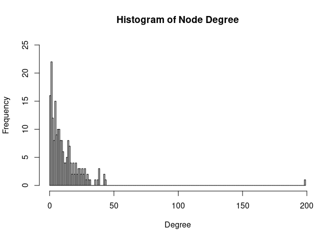

Network Analysis and Visualization with R, igraph, and Cytoscape
================
Dinçer Kılıç
2023-12-26

# Objective

The aim is to make a network analysis with 200 random nodes.

# Analysis

**Prerequisites**

First you need to set up your R environment. Install the required R
packages, which are igraph and RCy3.

**igraph** is a collection of network analysis tools.

**RCy3** allows communication between R and Cytoscape.

``` r
if(!"RCy3" %in% installed.packages()){
  install.packages("BiocManager")
  BiocManager::install("RCy3")
}

if(!"igraph" %in% installed.packages()){
  install.packages("BiocManager")
  BiocManager::install("igraph")
}
```

In addition to these packages (RCy3, igraph), you will need Cytoscape,
which can be downloaded from <http://www.cytoscape.org/download.php>.

There is also a need for the STRING app to access the STRING database
from within Cytoscape.

Install the STRING app from <https://apps.cytoscape.org/apps/stringapp>.

**Cytoscape** allows visualization and exploration of biological
networks.

**stringApp** imports functional associations or physical interactions
between protein-protein and protein-chemical pairs from several
databases into Cytoscape.

**Load the libraries on R**

``` r
library(igraph)
library(RCy3)
```

**Make sure to launch Cytoscape, and now connect R to Cytoscape**

``` r
cytoscapePing()
```

    ## You are connected to Cytoscape!

**Create data**

There are different ways to create random data, such as by reading
network data from files (edgelist, matrix), or by using functions, such
as sample_gnp(), sample_gnm(), make_graph(), and graph_from_literal().

I used stringApp for the given task. I extracted 199 nodes that have a
connection to the TP53 protein.

``` r
set.seed(135)
cmd.string = 'string protein query query="TP53" cutoff=0.9 species="Homo sapiens" limit=199'
commandsRun(cmd.string)
```

    ## [1] "Loaded network 'STRING network - TP53 - 4' with 200 nodes and 1227 edges"

**Transfer data**

The script above has created a network available on Cytoscape. Rename it
on Cytopscape as “TP53”, and transfer it from Cytoscape to R for the
rest of the analysis.

``` r
network <- createIgraphFromNetwork("TP53")
```

**Decide the layout**

``` r
# A list of available layouts
getLayoutNames()
```

    ##  [1] "attribute-circle"      "stacked-node-layout"   "attribute-grid"       
    ##  [4] "degree-circle"         "circular"              "attributes-layout"    
    ##  [7] "kamada-kawai"          "force-directed"        "cose"                 
    ## [10] "grid"                  "hierarchical"          "fruchterman-rheingold"
    ## [13] "isom"

``` r
# Select the “force-directed” layout. To see properties for the given layout, use:
getLayoutPropertyNames("force-directed") 
```

    ## [1] "Available arguments for 'layout force-directed':"

    ##  [1] "defaultEdgeWeight"        "defaultNodeMass"         
    ##  [3] "defaultSpringCoefficient" "defaultSpringLength"     
    ##  [5] "edgeAttribute"            "isDeterministic"         
    ##  [7] "maxWeightCutoff"          "minWeightCutoff"         
    ##  [9] "network"                  "nodeAttribute"           
    ## [11] "nodeList"                 "numIterations"           
    ## [13] "singlePartition"          "type"

``` r
layoutNetwork('force-directed defaultSpringLength=70 defaultSpringCoefficient=0.000003')
```

**Verify the attributes of network**

``` r
# The number of vertices and edges
igraph::vcount(network)
igraph::ecount(network)

# The names of vertices and edges
V(network)
E(network)
```

**Diameter**

The shortest distance between the two most distant nodes in the network.

Protein-protein interaction networks show a small world effect meaning
that there is great connectivity between proteins. In other words, it
can be said that the network’s diameter (the maximum number of steps
separating any two nodes) is small, no matter how big the network is.

``` r
diameter(network)
```

    ## [1] 10

**Distances**

It calculates the distance between all pairs of vertices and returns the
results as a distance matrix.

``` r
distances(network, mode = "all")
```

**Articulation point**

Removal of this point would destroy the whole network.

``` r
articulation.points(network)
```

    ## + 1/200 vertex, named, from 4eb0edc:
    ## [1] 9606.ENSP00000269305

**Degree centrality and degree distribution**

The degree tells us the number of edges that connect to a node.

``` r
deg <- degree(network, mode="all")
hist(deg, breaks=1:vcount(network)-1, 
     main="Histogram of Node Degree",
     xlab = "Degree")
```

<!-- -->

**Betweennes centrality**

Betweenness centrality captures which nodes are important in the flow of
the network. Betweenness effectively counts how many shortest paths each
node is on then divides it by the total number of shortest paths.

The higher a node’s betweenness, the more important they are for the
efficient flow of goods in a network.

``` r
bet <- betweenness(network)
bet[which.max(bet)]
```

    ## 9606.ENSP00000269305 
    ##             6540.154

**Closeness centrality**

Make use of the shortest paths between nodes. Calculated as;

N-1/sum geodesic distance of a given node

N-1/sum length of shortest paths which a given node is on

N: the number of nodes

``` r
clo <- closeness(network, normalized = T)
clo[which.max(clo)]
```

    ## 9606.ENSP00000269305 
    ##                    1

**Save the session and export**

``` r
full.path=paste(getwd(),'random_network_with_200_nodes',sep='/')
saveSession(full.path) #.cys
```

**Save image files with high resolution**

``` r
full.path=paste(getwd(),'random_network_with_200_nodes',sep='/')
exportImage(full.path, 'PNG', zoom=500) #.png scaled by 200%
exportImage(full.path, 'PDF') #.pdf
```

# Results


**Fig.1** Network analysis with 200 random nodes is presented. TP53 is
colored in red and other proteins are in yellow.

As a result of the analysis, we have a typical example of a
protein-protein interaction network (PPIN).

**Track versions for records**

``` r
cytoscapeVersionInfo()
```

    ##       apiVersion cytoscapeVersion 
    ##             "v1"         "3.10.1"

``` r
sessionInfo()
```

    ## R version 4.3.2 (2023-10-31)
    ## Platform: x86_64-pc-linux-gnu (64-bit)
    ## Running under: Ubuntu 20.04.6 LTS
    ## 
    ## Matrix products: default
    ## BLAS:   /usr/lib/x86_64-linux-gnu/blas/libblas.so.3.9.0 
    ## LAPACK: /usr/lib/x86_64-linux-gnu/lapack/liblapack.so.3.9.0
    ## 
    ## locale:
    ##  [1] LC_CTYPE=en_US.UTF-8       LC_NUMERIC=C              
    ##  [3] LC_TIME=en_US.UTF-8        LC_COLLATE=en_US.UTF-8    
    ##  [5] LC_MONETARY=en_US.UTF-8    LC_MESSAGES=en_US.UTF-8   
    ##  [7] LC_PAPER=en_US.UTF-8       LC_NAME=C                 
    ##  [9] LC_ADDRESS=C               LC_TELEPHONE=C            
    ## [11] LC_MEASUREMENT=en_US.UTF-8 LC_IDENTIFICATION=C       
    ## 
    ## time zone: Europe/Istanbul
    ## tzcode source: system (glibc)
    ## 
    ## attached base packages:
    ## [1] stats     graphics  grDevices utils     datasets  methods   base     
    ## 
    ## other attached packages:
    ## [1] RCy3_2.20.2  igraph_1.6.0
    ## 
    ## loaded via a namespace (and not attached):
    ##  [1] base64url_1.4       jsonlite_1.8.8      highr_0.10         
    ##  [4] compiler_4.3.2      crayon_1.5.2        gtools_3.9.5       
    ##  [7] IRdisplay_1.1       bitops_1.0-7        uuid_1.1-1         
    ## [10] yaml_2.3.8          fastmap_1.1.1       IRkernel_1.3.2     
    ## [13] R6_2.5.1            curl_5.2.0          knitr_1.45         
    ## [16] BiocGenerics_0.46.0 backports_1.4.1     graph_1.78.0       
    ## [19] XML_3.99-0.16       pillar_1.9.0        RColorBrewer_1.1-3 
    ## [22] rlang_1.1.2         utf8_1.2.4          repr_1.1.6         
    ## [25] xfun_0.41           caTools_1.18.2      fs_1.6.3           
    ## [28] RJSONIO_1.3-1.9     cli_3.6.2           magrittr_2.0.3     
    ## [31] digest_0.6.33       uchardet_1.2.0      rstudioapi_0.15.0  
    ## [34] base64enc_0.1-3     pbdZMQ_0.3-10       lifecycle_1.0.4    
    ## [37] vctrs_0.6.5         KernSmooth_2.23-22  evaluate_0.23      
    ## [40] glue_1.6.2          stats4_4.3.2        RCurl_1.98-1.13    
    ## [43] fansi_1.0.6         rmarkdown_2.25      httr_1.4.7         
    ## [46] tools_4.3.2         pkgconfig_2.0.3     htmltools_0.5.7    
    ## [49] gplots_3.1.3
